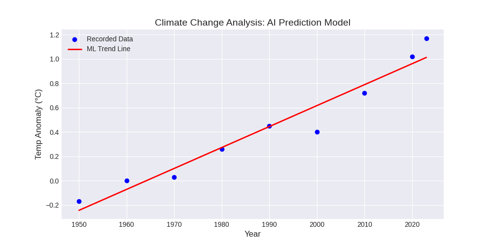

# Climate Change AI Analyzer ߌ

This project uses **Machine Learning (Linear Regression)** to analyze historical NASA global temperature anomalies and predict future trends.

## ߓ Results

*The model predicts a temperature anomaly of **1.13°C** by the year 2030 based on current linear trends.*

## ߛ️ Tech Stack
- **Language:** Python 3.11
- **Libraries:** Pandas (Data Handling), Matplotlib (Visualization), Scikit-Learn (Machine Learning)
- **Environment:** Developed on Windows 8.1 / PyCharm

## ߔ How it Works
1. **Data Collection:** Uses NASA GISTEMP annual mean datasets.
2. **Modeling:** Implements a Scikit-Learn `LinearRegression` model.
3. **Prediction:** The model is trained on historical data to forecast future climate anomalies.
