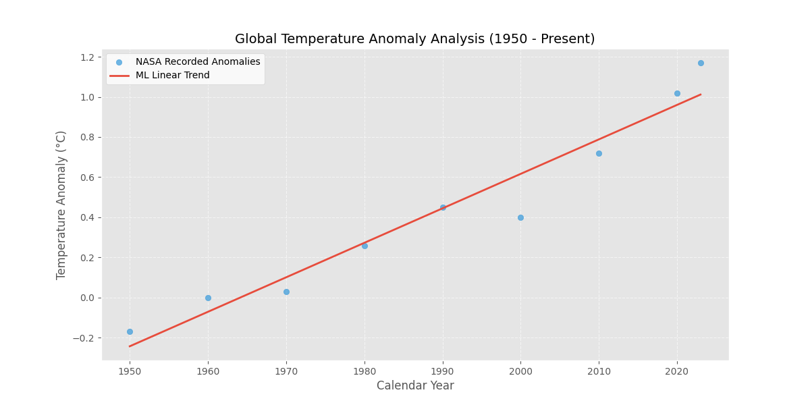

# Statistical Analysis and Predictive Modeling of Global Temperature Anomalies

## Project Overview
This repository contains a computational analysis of global surface temperature trends using NASA's GISTEMP v4 dataset. The objective is to apply supervised machine learning techniques to quantify the rate of global warming and forecast temperature anomalies for the upcoming decade.

## Data Methodology
The primary dataset consists of monthly and annual temperature anomalies from 1880 to the present. For this analysis:
* **Source:** NASA Goddard Institute for Space Studies (GISS).
* **Pre-processing:** Data was filtered to handle non-numeric artifacts and null values using the Pandas library to ensure statistical integrity.
* **Variable Selection:** The model utilizes 'Year' as the independent feature to predict the 'J-D' (January-December) annual mean anomaly.

## Machine Learning Implementation
The project implements a **Linear Regression** model via the `scikit-learn` framework. This model calculates the line of best fit by minimizing the sum of squared residuals, allowing for a linear approximation of the climatic trend over the last 70 years.

### Model Visualization

## Key Findings
* **Current Trend:** The model identifies a consistent positive slope, indicating an acceleration in global mean temperatures.
* **Forecast:** Based on historical data from 1950–2023, the model projects a temperature anomaly of approximately **1.13°C** for the year 2030.

## Technical Requirements
To replicate this study, the following Python environment is required:
* **Python 3.11**
* **NumPy & Pandas:** For data manipulation and matrix operations.
* **Scikit-Learn:** For the implementation of the regression algorithm.
* **Matplotlib:** For high-resolution data visualization.

---
*Developed as part of an Advanced Data Science portfolio for scholarship evaluation.*
